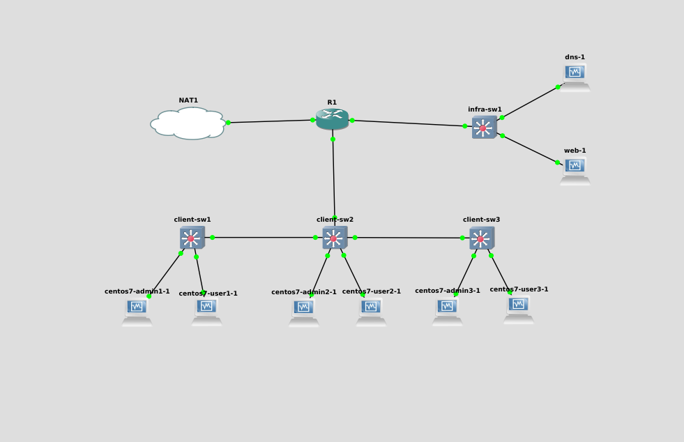

# TP4 : Buffet à volonté

## La topo de base
#### Configuration actuelle (21/04/2020)

[Configuration R1](router.txt)

[Configuration client-sw-1](client-sw1.txt)

[Configuration client-sw-2](client-sw2.txt)

[Configuration client-sw-3](client-sw3.txt)

Voilà à quoi ressemble notre topologie :

<div align="center"></div>

## Observium

On a choisit de découvrir Observium car ca a l'air stylé et nous avons un peu travaillé sur Grafana ces derniers temps car la data viz nous intéresse.

### Qu'est-ce qu'Observium ?

C'est un outil de moniroting (d'ou le côté Data Visualisation). L'outil utilise le protocole SNMP (Simple Network Management Protocol). Les points sympathiques sont que c'est gratuit et open source, et ça, on aime. Aussi, c'est relativement facile à mettre en place.

### Qu'est-ce que SMNP

SMNP est un protocole qui permet de superviser, gérer et contrôler les équipements du réseaux à distance.

### Installer Observium sur Centos 7

#### On ajoute les repos : REMI, OpenNMS et EPEL

```
yum install https://dl.fedoraproject.org/pub/epel/epel-release-latest-7.noarch.rpm
yum install http://yum.opennms.org/repofiles/opennms-repo-stable-rhel7.noarch.rpm
yum install http://rpms.remirepo.net/enterprise/remi-release-7.rpm
```

#### Installation de yum-utils

`yum install yum-utils`

#### Activer PHP 7.2

`yum-config-manager --enable remi-php72`

#### On met à jour les packages

`yum update`

#### Packages nécessaires pour Observium

```
yum install wget.x86_64 httpd.x86_64 php.x86_64 php-opcache.x86_64 php-mysql.x86_64 php-gd.x86_64 \
            php-posix php-pear.noarch cronie.x86_64 net-snmp.x86_64 net-snmp-utils.x86_64 \
            fping.x86_64 mariadb-server.x86_64 mariadb.x86_64 MySQL-python.x86_64 rrdtool.x86_64 \
            subversion.x86_64  jwhois.x86_64 ipmitool.x86_64 graphviz.x86_64 ImageMagick.x86_64 \
            php-sodium.x86_64
```

#### Création du dossier Observium

`mkdir -p /opt/observium && cd /opt`

#### Téléchargement et extraction de Observium Community Edition

`wget http://www.observium.org/observium-community-latest.tar.gz`

puis

`tar zxvf observium-community-latest.tar.gz`

#### Mariadb (car c'est Open Source)

On active mariadb au démarrage, et on le démarre.

```
systemctl enable mariadb
systemctl start mariadb
```

#### Création de la base de donnée

```
sudo mysql
mysql> CREATE DATABASE observium DEFAULT CHARACTER SET utf8 COLLATE utf8_general_ci;
```

#### Création de l'utilisateur observium

```
mysql> GRANT ALL PRIVILEGES ON observium.* TO 'observium'@'localhost' IDENTIFIED BY '<observium db password>';
mysql> exit;
```
